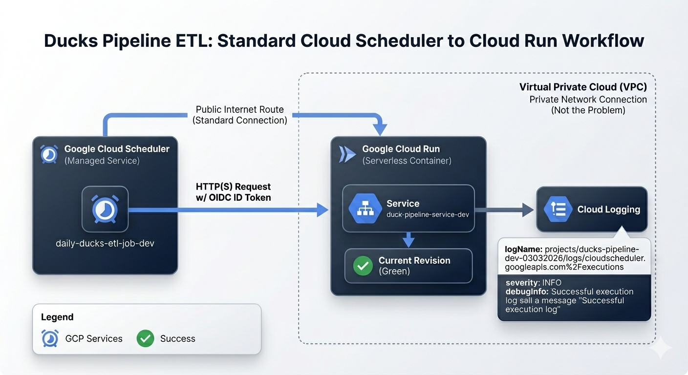

# About duck-pipeline-dev

This project implements a batch ETL (Extract, Transform, Load) pipeline that queries the Ducks Unlimited API's university chapter and extracts the `california` chapters. The solution is containerised using **Docker**, served in **Cloud Run Service** and triggered via **Cloud Scheduler** once a day. This solution implements the end-to-end CI/CD using **Cloud Build**, stores the data in Postgres via **CloudSQL** and manages credentials using **Secrets Manager** and **KMS**.

Production-grade batch ETL platform built entirely on **GCP**, provisioned with **Terraform** as Infrastructure as Code (IaC). Demonstrates enterprise patterns including credential management via **Secrets Manager** and **KMS** for key rotation, end-to-end **CI/CD** with **Cloud Build**, containerised deployment on **Cloud Run**, and scheduled execution via **Cloud Scheduler**. Data is persisted to PostgreSQL via **Cloud SQL**.
----

## Tools

| Tool                 | Usage         |
| ---------------------| ------------- |
|Cloud Provider        | |
|Platform Building     | |
|Pipeline Construction | |

## Architecture

* **Service:** Google Cloud Run (HTTP-based)
* **Trigger:** Cloud Scheduler (Cron)
* **Region:** `us-central1` (recommended)
* **Networking:** Public Ingress (IAM-authenticated)

<p align="center">
  
</p>

---

## Prerequisites

* Terraform >= 1.0.0
* Google Cloud SDK (gcloud)
  
---

## Project setup

* Permissions (for your personal account  or SA): `roles/run.admin`, `roles/cloudscheduler.admin`,  `roles/iam.serviceAccountUser`
* Via web console, create a new Project and attach it to a Billing Account.
* Create a Bucket to be used as a *backed bucket* to store the Terraform status files.
* Replace this bucket name in the file */terraform/envs/dev/backend.tf*

### Connect the Github Repository to Cloud

1. Go to the *Cloud Build Triggers* page.
2. Click *Manage Repositories* -> *Connect Repository*.
3. Select *GitHub (Cloud Build GitHub App)*.
4. Follow the prompts to authorise your account and select your ducks-pipeline repository.
5. Create the repository in the same region you have created the project (`us-central1`).

### Google Cloud connection

1. Choose the account you want to use for this configuration.

```
gcloud init
```

2. Pick the cloud project to use
3. Log in to the cloud by following the link provided after executing the command below

```
gcloud auth login 
```

4. Select your Google account 
5. Allow Google Cloud to access your account by clicking *Allow*

### Configure Docker

```
gcloud auth configure-docker <Project_region>-docker.pkg.dev
```
---

## Deployment

The deployment process involves the steps below:

> [!NOTE]
> A circular reference will be created between Cloud Run Service and Artefact Registry. The first, require an image that has not been created yet, and the second requires a Service to crete an image. To avoid this circular reference, execute step 0. **Set Up** only the first time or after executing *terraform destroy*

0. **Set Up**
   Uncomment lines below in the *terraform/modules/services/main.tf* file. This will create the service using a basic, ready to use google image.

```
#image = "us-docker.pkg.dev/cloudrun/container/hello"  <-- Uncomment this line
image = var.image_path <-- Comment this line
```
1. Cloud login and Authorization
Execute the command below to login the Cloud provider
```
gcloud auth login
```
2. Set the default project
```
gcloud config set project <YOUR_PROJECT_ID>
```
3. **Initialize Terraform:**
```
terraform init
```

4. **Plan the infrastructure**
```
terraform plan -out=tfplan
```

5. **Apply changes**
```
apply -var="project_id=<YOUR_PROJECT_ID>"
```
---

## Local Reproduction

To test the ETL logic locally without deploying to Cloud Run:
1. Build the Docker image:
```
docker build -t ducks-etl .
```

2. Run the container:
```
docker run -p 8080:8080 ducks-etl
```

3. Trigger the process:
```
curl localhost:8080
```

---

## Scheduled Execution

1. The job is configured to run automatically via Cloud Scheduler.
```  Job Name: daily-ducks-etl-job-dev
 Target URI: https://duck-pipeline-service-dev-248136157540.us-central1.run.app
```

2. Manual Trigger. To manually invoke the production pipeline with authentication:
```
gcloud scheduler jobs run daily-ducks-etl-job-dev --location=us-central1
```

---

## Future Improvements

Possible improvements to this project:

* Add monitoring and alerting 
* Add functionality to promote to other environments (TST, PRE, PRD) :construction:
